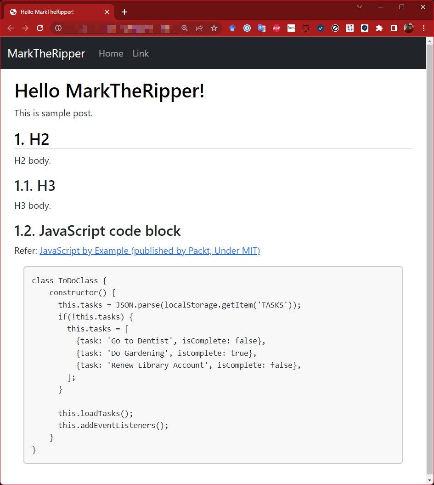

# MarkTheRipper


MarkTheRipper - Fantastic faster generates static site comes from simply Markdowns.

[](https://www.repostatus.org/#wip)

## NuGet

| Package  | NuGet                                                                                                                |
|:---------|:---------------------------------------------------------------------------------------------------------------------|
| MarkTheRipper | [](https://www.nuget.org/packages/MarkTheRipper) |
| MarkTheRipper.Core | [](https://www.nuget.org/packages/MarkTheRipper.Core) |

## CI

| main                                                                                                                                                                 | develop                                                                                                                                                                       |
|:---------------------------------------------------------------------------------------------------------------------------------------------------------------------|:------------------------------------------------------------------------------------------------------------------------------------------------------------------------------|
| [](https://github.com/kekyo/MarkTheRipper/actions?query=branch%3Amain) | [](https://github.com/kekyo/MarkTheRipper/actions?query=branch%3Adevelop) |

----

[](https://github.com/kekyo/MarkTheRipper/blob/main/README_ja.md)

## What is this?

TODO: Eventually this document will be converted by MarkTheRipper itself.

MarkTheRipper is a very simple and fast static site generator
that allows you to write content in markdown.
The main intended use is for blog sites,
but we have eliminated the need for complex structures and tools anyway,
as if you were writing an article on GitHub Gist likely.

If you already have .NET 6.0 installation, you can install it simply:

```bash
dotnet tool install -g MarkTheRipper
```

Then at first time, you will need to run:

```bash
$ mtr new mininum
```

Will generate a sample files under your current directory as follows
(Don't be afraid! It's only TWO FILES with a few lines of content
and almost no extra definitions!)

* `contents` directory: `index.md`,
  It is a content (post) file written by markdown.
* `resources` directory: `template-page.html`,
  When the site is generated, the markdown is converted to HTML and inserted into this template file.

That's it! Just to be sure, let's show you what's inside:

### index.md

```markdown
---
title: Hello MarkTheRipper!
tags: [foo,bar]
---

This is sample post.

## H2

H2 body.

### H3

H3 body.
```

### template-page.html

```html
<!DOCTYPE html>
<html lang="{lang}">
<head>
    <meta charset="utf-8" />
    <meta name="keywords" content="{tags}" />
    <title>{title}</title>
</head>
<body>
    <header>
        <h1>{title}</h1>
    </header>
    <hr />
    <article>
        {contentBody}
    </article>
</body>
</html>
```

If you look at the content, you can probably guess what happens:
MarkTheRipper simply converts the keywords and body into HTML and inserts it into the template.
Therefore when customizing a template,
common HTML/CSS/JavaScript techniques can be applied as is,
and there are no restrictions.

(MarkTheRipper is written in .NET, but the user does not need to know about .NET)

Let's generate the site as is. Generating a site is very easy:

```bash
$ mtr
````

If your directory structure is the same as the sample, just run ``mtr`` to generate the site.
Site generation is multi-threaded and multi-asynchronous I/O driven,
so it is fast even with a large amount of content.
By default, the output is under the `docs` directory.
In this example, the `contents/index.md` file is converted and placed in the `docs/index.html` file.

You will then immediately see a preview in your default browser:


Site generation will delete all files in the `docs` directory and generate them again each time.
If you manage the entire directory with Git,
you can commit the site including the `docs` directory.
Then you can check the differences of the actual generated files.
You can also push it straight to `github.io` and easily publish your site!

There are no restrictions on the file names of markdown files or the subdirectories in which they are placed.
If there are files with the extension `.md` under the `contents` directory,
it does not matter what kind of subdirectories they are placed in,
under what kind of file names, or even if there are many of them.
All `.md` files will be converted to `.html` files, keeping the structure of the subdirectories.

Files with non `.md` extensions will simply be copied to the same location.
Additional files, such as pictures for example,
can be placed as you wish to manage them,
and you can write markdowns with relative paths to point to them.

----

## A more practical sample

The samples generated by `mtr new minimum` are too simple (minimum is not a bad thing!),
but in case you want to see some more customized examples,
Several samples are built in as standard.

Two more examples are built in:

```bash
$ mtr new sidebar
$ mtr new standard
$ mtr new rich
````

You can specify the sample `sidebar`, `standard` or `rich`.
The following features are available:

|Name|Description|
|:----|:----|
|`sidebar`|Added sidebar navigation on `minimum` sample by CSS flex. If you want to design the whole thing from scratch, it is convenient because it does not contain any extra definitions.|
|`standard`|Looks like GitHub's code block design (but does not have syntax highlighting). Uses [bootstrap.js 5.0](https://getbootstrap.jp/).|
|`rich`|Syntax highlighting by [prism.js](https://prismjs.com/). Uses bootstrap.js 5.0.|




No need to worry. These samples have also been implemented
with the utmost care to keep the template code to a simplest.
They are easy to understand and even HTML beginners
can start customizing with these samples.

----

## Template details

MarkTheRipper templates are very simple, yet flexible and applicable enough for your needs.
The templates provide all keyword substitutions by referencing a "Metadata dictionary".

Here is an example of a template substitution.

### Keyword Substitution

The simplest example is a simple keyword substitution. Suppose you define the following template:

```html
<title>{title}</title>
```

This will replace the keyword `title` in the metadata dictionary with the corresponding value.
The value of `title` is defined at the beginning of the corresponding markdown document:

```markdown
---
title: Hello MarkTheRipper!
---

(... Body ...)
```

If you have tried other site generators, you may know how to add these special "header lines" to your markdown to insert a title, date, tags and etc.
MarkTheRipper also follows this convention syntactically, but is more flexible.
For example, the following example produces exactly the same result:

```html
<title>{foobar}</title>
```

```markdown
---
foobar: Hello MarkTheRipper!
---

(... Body ...)
```

Do you somehow see how you can make use of metadata dictionaries?
In other words, MarkTheRipper can treat any set of "key-value" pairs you write in the markdown header as a metadata dictionary,
and you can reflect any number of them on the template.

Arbitrary keywords can be substituted anywhere on the template,
allowing for example the following applications:

```html
<link rel="stylesheet" href="{stylesheet}.css">
```

```markdown
---
title: Hello MarkTheRipper!
stylesheet: darcula
---

(... Body ...)
````

Perhaps this feature alone will solve most of the problems.

### Special keywords and fallbacks

There are several special but potentially important keywords in this metadata dictionary.
They are listed below:

|Keyword|Note|
|:----|:----|
|`generated`|Date and time when the site was generated.|
|`template`|The name of the template to apply.|
|`lang`|Locale (`en-us`, `ja-jp`, etc.)|
|`date`|Date of the post.|

* There are several other special keywords, which will be explained later.

These keywords can be overridden by writing them in the markdown header.
It may not make sense to override `generated`, but just know that MarkTheRipper does not treat metadata dictionary definitions specially.

You may be wondering what the default values of `lang` and `template` are.
Metadata dictionaries can be placed in `resources/metadata.json`,
which is the base definition for site generation.
(It does not have to be there. In fact, it is not present in the minimum/sidebar samples.)
For example, the following definition:

```json
{
  "title": "(Draft)",
  "author": "Mark the Ripper",
  "template": "page",
  "lang": "en-us"
}
```

This reveals something interesting. The value of the `title` keyword is "(Draft)".
For example, consider the following template:

```html
<meta name="author" content="{author}" />
<title>{title}</title>
```

If you specify `title` in the markdown, that title will be inserted,
otherwise the title "(Draft)" will be inserted.
Similarly, if `author` is specified, the name of author will be inserted,
otherwise "Mark the Ripper" will be inserted.

If you are thinking of using this for a blog, you may not want to put your name in the header of the markdown,
since most of your posts will be written by yourself.
However, the title will of course be different for each post.
In such cases, you can use the "fallback" feature of the metadata dictionary.

And as for the `lang` and `template` fallback:

* Only if `template` is not found in the fallback, the template name `page` is used.
* Only if `lang` is not found in the fallback, the system default language is applied.

The template name may need some supplementation.
The template name is used to identify the template file from which the conversion is being made.
For example, if the template name is `page`, the file `resources/template-page.html` will be applied. If:

```markdown
---
title: Hello MarkTheRipper!
template: fancy
---

(... Body ...)
```

then `resources/template-fancy.html` will be used.

The `date` represents the date and time of the article and is treated like an ordinary keyword,
but if it is not defined in the markdown header,
the date and time of generation will be inserted into the markdown header automatically.

You may feel that `lang` is simply one of the ordinary keywords.
This is explained in the next section.

### Format parameters

TODO:

### Recursive keyword search

You may want to pull results from the metadata dictionary again,
using the keywords as the result of the metadata dictionary pull.
For example, you might want to look up:

```markdown
---
title: Hello MarkTheRipper!
category: blog
---

(... Body ...)
```

A `category` keyword is like a category of articles.
Here, it is named `blog`, but if you refer to it by keyword as follows:

```html
<p>Category: {category}</p>
```

The HTML will look like `Category: blog`.
This may work fine in some cases, but you may want to replace it with a more polite statement.
So you can have the metadata dictionary search for the value again,
using `blog` as the keyword.
Add an asterisk `*` before the keyword:

```html
<p>Category: {*category}</p>
```

If you do this and register the pair `blog` and `Private diary` in the metadata dictionary,
the HTML will show `Category: Private diary`.

Such keyword/value pairs can be referenced by writing them in `resources/metadata.json` as shown in the previous section.
In addition, the metadata dictionary file is actually all JSON files matched by `resources/metadata*.json`.
Even if the files are separated,
they will all be read and their contents merged when MarkTheRipper starts.

For example, it would be easier to manage only article categories as separate files,
such as `resource/metadata-category.json`.

This recursive search can be performed only once (by design).
In other words, it is not possible to keep searching repeatedly using the obtained values as keys.

### Enumeration and nesting

For classifications such as "category" and "tag",
you would want to have the user select them from a menu and be taken to that page.
For example, suppose there are 5 tags on the entire site.
You would automatically add these to the page's menu.
To allow the user to navigate to a page classified under a tag from the menu, we can use the enumerator.
As usual, let's start with a small example.

This is the template included in minimum:

```html
<p>Tags:{foreach:tags} '{item}'{/}</p>
```

* The `tags` keyword indicates a list of tags (see below)

This means that documents between `{foreach:tags}` and `{/}` will be repeated as many times as the number of `tags`.
"Documents between" are, in this case: ` '{item}'`.
Note the inclusion of spaces.
Likewise, it can contain line breaks, HTML tags, or anything else in between.

Now suppose we convert the following markdown:

```markdown
---
title: Hello MarkTheRipper
tags: [foo,bar]
---

(... Body ...)
````

Then the output will be `<p>Tags: 'foo' 'bar'</p>`.
The `foo,bar` in `tags` have been expanded and quoted in the output, each separated by space.

Again, documents between `{foreach:tags}` and `{/}` are output repeatedly, so you can use the following:

```html
<ul>
  {foreach:tags}
  <li>{item.index} {item}</li>
  {/}
</ul>
```

Result:

```html
<ul>
  <li>0 foo</li>
  <li>1 bar</li>
</ul>
```

The `{item}` inserted between the tags is a keyword that can refer to each repeated value.
Also, specifying `{item.index}` will give you a number starting from 0 and counting 1,2,3....

In addition, you can nest different keywords.
For example, for each category and you can enumerate multiple tags.

In addition, multiple keywords can be nested.
The following example repeats the tag twice:

```html
<ul>
  {foreach:tags}
  {foreach:tags}
  <li>{item.index} {item}</li>
  {/}
  {/}
</ul>
```

Result:

```html
<ul>
  <li>0 foo</li>
  <li>1 bar</li>
  <li>0 foo</li>
  <li>1 bar</li>
</ul>
```

Note, by the way, that `item` in this case refers to a double nested inner `tags` iteration.
In some cases, you may want to use the value of the outer iteration.
In that situation, you can specify a "bound name" for the `foreach`:

```html
<ul>
  {foreach:tags tag1}
  {foreach:tags tag2}
  <li>{tag1.index}-{tag2.index} {tag1}/{tag2}</li>
  {/}
  {/}
</ul>
```

Result:

```html
<ul>
  <li>0-0 foo-foo</li>
  <li>0-1 foo-bar</li>
  <li>1-0 bar-foo</li>
  <li>1-1 bar-bar</li>
</ul>
```

If the bound name is omitted, `item` is used.
Now you have a grasp of how to use `foreach` for repetition.

### Aggregate tags

Once you understand how to use repetition, you are as good as done with tags and categories.
MarkTheRipper automatically aggregates all the tags and categorizations of your content.
Tags can be referenced by the following special keywords:

|Keywords|Note|
|:----|:----|
|`tagList`|Aggregate list of all tags.|
|`rootCategory`|A category that is the root. (It is no classification)|

First, let's make a list of tags:

```html
<ul>
  {foreach:tagList}
  <li>{item}</li>
  {/}
</ul>
```

Result:

```html
<ul>
  <li>foo</li>
  <li>bar</li>
  <li>baz</li>
       :
</ul>
```

In the previous section we repeated the use of `tags` defined for the markdown file, here we use `tagList`.
The difference is that we are not dealing with a single markdown file, but with the aggregated tags of all markdown files processed by MarkTheRipper.

In other words, you can use `tagList` to add menu items and link lists by tags.
How do I add a link to each tag entry?
Tags alone do not tell us the set of contents associated with a tag,
but in fact tags can be enumerated using `foreach`:

```html
{foreach:tagList tag}
<h1>{tag}</h1>
{foreach:tag.entries entry}
<h2><a href="{entry.path}">{entry.title}</a>
{/}
{/}
```

Note that we specify the bound name to make it easier to understand what we are trying to enumerate.

Enumerating the `entries` property gives access to information about the corresponding markdowns.
Using the property `path` as in this example,
gives the path to the file corresponding to the content,
and referencing its `relative` property again gives the path relative to the current content.
Using the property `title` to get its title (the `title` described in the markdown header).

* The `path` gives the relative path to the converted HTML file, not the path to the markdown.
  Therefore, it is safe to use it as is.

### Aggregate categories

Categories can be referenced by the following special keywords:

|keywords|content|
|:----|:----|
|`category`|a hierarchical list of categories. Describe in the header part of each markdown|
|`rootCategory`|The root (unclassified) category|

The critical difference between tags and categories is that tags are defined in parallel,
while categories are defined with hierarchy. For example:

````
(root) --+-- foo --+-- bar --+-- baz --+-- foobarbaz1.md
         |         |         |         +-- foobarbaz2.md
         |         |         |
         |         |         +-- foobar1.md
         |         |
         |         +--- foo1.md
         |         +--- foo2.md
         |         +--- foo3.md
         |
         +--- blog1.md
         +--- blog2.md
````

In the above example, `foobarbaz1.md` belongs to the category `foo/bar/baz`.
And `blog1.md` does not belong to any category,
it is supposed to belong to implicit hidden `(root)` category inside MarkTheRipper.
It is the `rootCategory` keyword.

For tags we defined it using the `tags` keyword, but for categories we use the keyword `category`.
The definition corresponding to `foobarbaz1.md` above is:

```markdown.
---
title: Hello MarkTheRipper
category: [foo,bar,baz]
---

(... Body ...)
```

Specifies the hierarchy as a list. Note that unlike tags, this list represents a hierarchy.
CMSs and site generators often refer to such hierarchies as "breadcrumb" lists.

By the way, MarkTheRipper can determine the category from the directory name by simply placing
the content in a categorized subdirectory,
without having to specify the category with the `category` keyword.
Therefore, to categorize content by category, you only need to place it in categorized subdirectories.

Now that we have grasped the basic structure of categories,
let's actually write the template.
First, enumerate the root category:

```html
<h1>{rootCategory.name}</h1>
<ul>
  {foreach:rootCategory.entries entry entry}
  <li>{entry.path}</li>
  {/}
</ul>
```

Result:

```html
<h1>(root)</h1>
<ul>
  <li>blog1.html</li>
  <li>blog2.html</li>
</ul>
```

Since `rootCategory` represents the root category, its property `name` is `(root)`.
If this name is not appropriate for display,
you can replace it using recursive keyword search expression,
or you can write it directly since it is root in this example.

Then, like the tags, you can pull the header information for each markdown
from each of the elements enumerated in the `entries`.

Here, `path` is used to output the path to the content, but you can use `title` to output the title.
If you use `item.path.relative`, you can get the path relative to the current content,
which can be used as the URL of the link to realize the link.

To enumerate categories, use the `children` property:

```html
<h1>{rootCategory.name}</h1>
{foreach:rootCategory.children child1}
<h2>{child1.name}</h2>
{foreach:child1.children child2}
<h3>{child2.name}</h3>
{/}
{/}
```

If we nest the enumerations repeately, we can enumerate all deep category structures.
Unfortunately, it is not possible to dynamically enumerate the category structure,
i.e., automatic recursively enumerate even the descendant categories that exist.
This is by design because MarkTheRipper does not have the ability to define any functions and recursive functions.
(Such a request is probably only for outputting a site-wide structure list, as we did not see the need for such a request.)

At the end of the category operation is an example of outputting a breadcrumb list.
It is very simple:

```html
<ul>
  {foreach:category.breadcrumb}
  <li>{item.name}</li>
  {/}
</ul>
```

The ``breadcrumb`` property returns a value that allows you to enumerate the categories leading to the target category,
starting from the root (but excluding the root itself).
The individual elements enumerated are the same as for the categories described so far.
In the above example, the `name` property outputs the name of the category.

----

## Install develop branch package

```
$ dotnet tool install -g MarkTheRipper --nuget-source http://nuget.kekyo.online:59103/repository/nuget/index.json
```

----

## License

Apache-v2.

----

## History

TODO:
