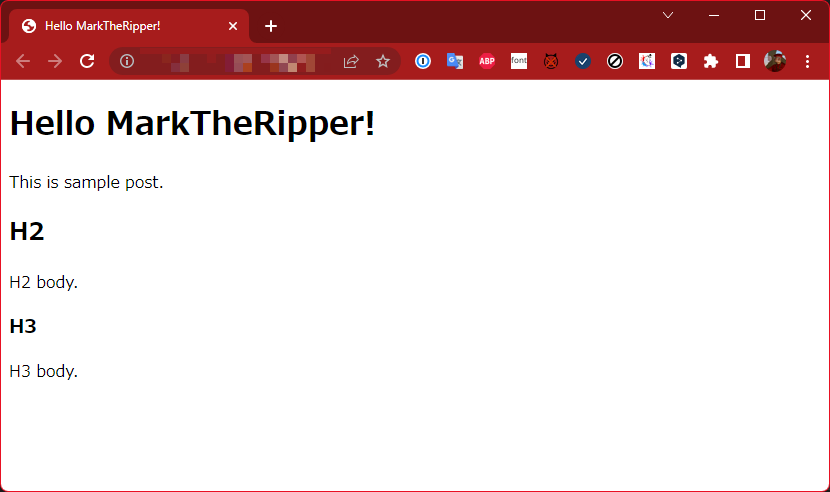
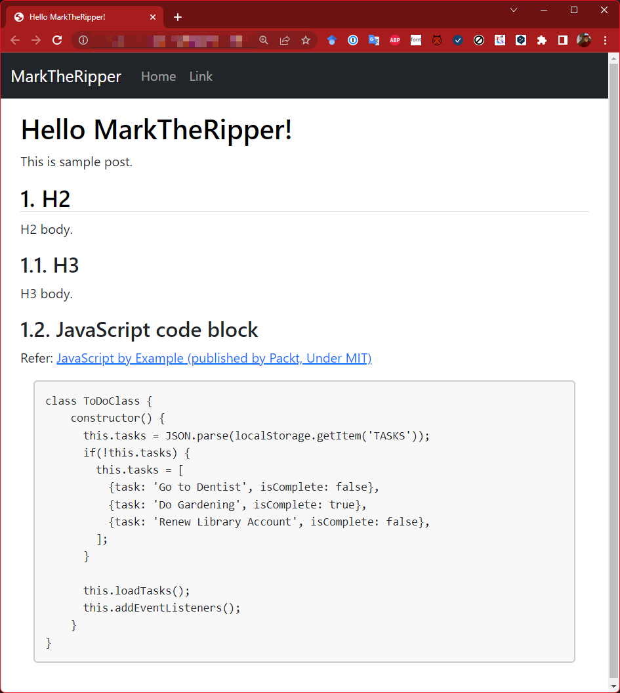
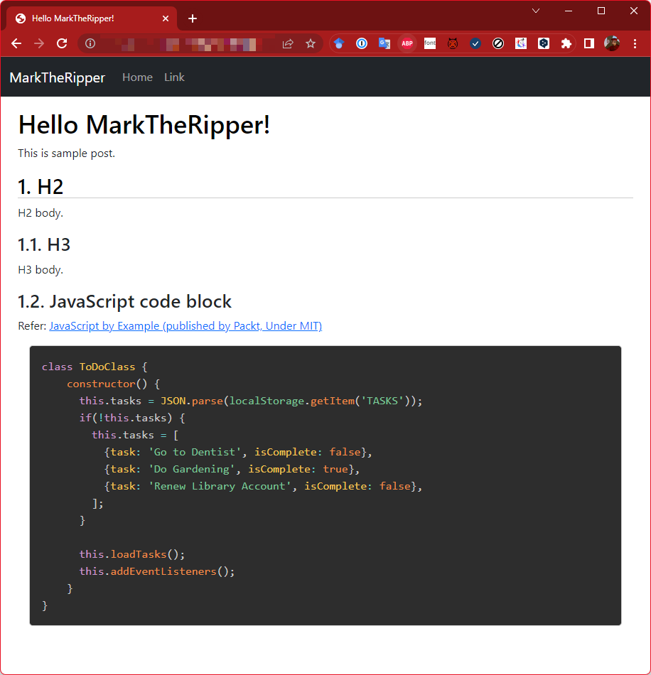

# MarkTheRipper


MarkTheRipper - マークダウンで書く事が出来る、静的サイトの高速生成ツール。

[](https://www.repostatus.org/#wip)

## NuGet

| Package  | NuGet                                                                                                                |
|:---------|:---------------------------------------------------------------------------------------------------------------------|
| MarkTheRipper | [](https://www.nuget.org/packages/MarkTheRipper) |
| MarkTheRipper.Core | [](https://www.nuget.org/packages/MarkTheRipper.Core) |

## CI

| main                                                                                                                                                                 | develop                                                                                                                                                                       |
|:---------------------------------------------------------------------------------------------------------------------------------------------------------------------|:------------------------------------------------------------------------------------------------------------------------------------------------------------------------------|
| [](https://github.com/kekyo/MarkTheRipper/actions?query=branch%3Amain) | [](https://github.com/kekyo/MarkTheRipper/actions?query=branch%3Adevelop) |

----

[English is here](https://github.com/kekyo/MarkTheRipper)

## これは何？

TODO: 最終的にこのドキュメントは、MarkTheRipper自身で変換する予定です。

MarkTheRipperは、非常にシンプルかつ高速な静的サイトジェネレータで、コンテンツをマークダウンで書くことができます。
主に想定される用途はブログサイトですが、まるでGitHub Gistで記事を書いているかのように、とにかく複雑な構造やツールの要求、というものを排除しました。

.NET 6.0をインストールしている環境なら、

```bash
dotnet tool install -g MarkTheRipper
```

とするだけでインストールできます。または、.NET Framework 4.8に対応した、ポータブルバージョンのバイナリをダウンロードする事もできます。

初めて使う場合は、

```bash
$ mtr new mininum
```

とすると、現在のディレクトリの配下に、以下のようにサンプルのひな形が生成されます。
（恐れる必要はありません！たった2つ、しかも中身は余計な定義が殆ど存在しない、数行のファイルです！）

* `contents`ディレクトリ: `index.md`ファイルが置かれます。中身は一般的に想定されるマークダウンによる記事テキストです。
* `resources`ディレクトリ: `template-page.html`ファイルが置かれます。サイト生成するときに、マークダウンがHTMLに変換され、このテンプレートファイルの中に挿入されます。

これだけです！念のために、中身も見せましょう:

### index.md

```markdown
---
title: Hello MarkTheRipper!
tags: [foo,bar]
---

This is sample post.

## H2

H2 body.

### H3

H3 body.
```

### template-page.html

```html
<!DOCTYPE html>
<html lang="{lang}">
<head>
    <meta charset="utf-8" />
    <meta name="keywords" content="{tags}" />
    <title>{title}</title>
</head>
<body>
    <header>
        <h1>{title}</h1>
        <p>Category:{foreach:category.breadcrumb} {item.name}{/}</p>
        <p>Tags:{foreach:tags} {item.name}{/}</p>
    </header>
    <hr />
    <article>
        {contentBody}
    </article>
</body>
</html>
```

中身を見れば、何がどうなるのか想像も付くと思います。MarkTheRipperは、キーワードと本文をHTMLに変換して、テンプレートに挿入しているだけです。
なので、テンプレートをカスタマイズする時には、一般的なHTML/CSS/JavaScriptの技法をそのまま適用でき、制約は殆どありません。

(MarkTheRipperは.NETで書かれていますが、使用者は.NETの事を知らなくても問題ありません)

それでは、そのままサイトを生成してみましょう。サイト生成も非常に簡単です:

```bash
$ mtr
```

ディレクトリ構成がサンプルと同じであれば、`mtr`を実行するだけでサイトを生成します。
サイト生成はマルチスレッド・マルチ非同期I/Oで行うので、大量のコンテンツがあっても高速です。
デフォルトでは、`docs`ディレクトリ配下に出力されます。
この例では、`contents/index.md`ファイルが、`docs/index.html`ファイルに変換されて配置されます。

その後、すぐにデフォルトのブラウザでプレビューが表示されます:



サイト生成は、毎回`docs`ディレクトリ内のファイルをすべて削除して、生成し直します。
ディレクトリ全体をGitで管理している場合は、`docs`ディレクトを含めてコミットしてOKです。
そうすれば、実際に生成されたファイルの差分を確認することが出来ます。
また、`github.io`にそのままpushして、簡単にあなたのサイトを公開出来ます！

マークダウンファイルのファイル名や、配置するサブディレクトリにも制約はありません。
`contents`ディレクトリ配下で拡張子が`.md`のファイルがあれば、どのようなサブディレクトリにどのようなファイル名で配置されていても、また、多数存在していても構いません。
サブディレクトリの構造を保ったまま、全ての`.md`ファイルが`.html`ファイルに変換されます。

`.md`ではない拡張子のファイルは、単純に同じ場所にコピーされます。
例えば、写真などの追加ファイルは、あなたが管理したいように配置して、そこを指すように相対パスでマークダウンを書けば良いのです。

----

## もう少し実用的なサンプル

`mtr new minimum`が生成するサンプルはあまりにシンプルであり（minimumは伊達じゃありません！）、もう少しカスタマイズの例が見たいという場合のために、
標準でサンプルをいくつか内蔵しています。

```bash
$ mtr new sidebar
$ mtr new standard
$ mtr new rich
```

`sidebar`、`standard`または`rich`というサンプルを指定できます。以下のような機能があります:

|名称|内容|
|:----|:----|
|`sidebar`|`minimum`サンプルに、CSS flexによるサイドバーナビゲーションを追加したものです。全体的に一からデザインしたい場合は、余計な定義が一切含まれていないので、都合がよいでしょう。|
|`standard`|GitHubのコードブロックのデザインに似た見た目になります。シンタックスハイライトはありません。[bootstrap.js 5.0](https://getbootstrap.jp/)を使用しています。|
|`rich`|シンタックスハイライトに [prism.js](https://prismjs.com/) を使います。これも、bootstrap.js 5.0 を使っています。|





心配無用です。これらのサンプルも、最小のテンプレートコードとなるよう、最新の注意を払って実装しました。
理解も容易で、HTMLのビギナーでも、これらのサンプルでカスタマイズを始める事が出来ます。

----

## テンプレートの詳細

MarkTheRipperのテンプレートは、非常にシンプルでありながら、必要十分な柔軟性と応用性を備えています。
テンプレートは、「メタデータ辞書」を参照することで、すべてのキーワード置換を実現します。

テンプレートの置換例を示します。

----

### キーワードの置き換え

もっとも簡単な例は、単純なキーワードの置き換えです。次のようなテンプレートを定義したとします:

```html
<title>{title}</title>
```

これは、メタデータ辞書の`title`というキーワードに対応する値に置き換えます。
`title`の値はどこにあるかというと、対応するマークダウン文書の先頭で定義します:

```markdown
---
title: Hello MarkTheRipper!
---

(... 本文 ...)
```

他のサイトジェネレーターを試したことがある場合は、マークダウンにこのような特別な「ヘッダ行」を追加して、タイトルや日時などを挿入する方法を知っているかもしれません。
MarkTheRipperも、構文上はこの慣例に従っていますが、もっと柔軟です。例えば、以下の例は全く同じ結果を生成します:

```html
<title>{foobar}</title>
```

```markdown
---
foobar: Hello MarkTheRipper!
---

(... 本文 ...)
```

何となく、メタデータ辞書をどう活用すれば良いか、見えてきましたか？
つまりMarkTheRipperは、マークダウンのヘッダに書いた「キーワードと値」の組をメタデータ辞書として扱うことが出来て、テンプレート上にいくつでも反映することが出来ます。

任意のキーワードを、テンプレート上の任意の箇所で置き換えできるので、例えば以下のような応用が可能です:

```html
<link rel="stylesheet" href="{stylesheet}.css">
```

```markdown
---
title: Hello MarkTheRipper!
stylesheet: darcula
---

(... 本文 ...)
```

恐らく、この機能だけでも、大部分の問題は解決すると思います。

----

### 特殊なキーワードとフォールバック

このメタデータ辞書には、特殊な、しかし重要と思われるキーワードがいくつか存在します。以下に示します:

|キーワード|内容|
|:----|:----|
|`generated`|MarkTheRipperでサイトを生成した日時|
|`template`|適用するテンプレート名|
|`lang`|ロケール(`en-us`や`ja-jp`など)|
|`date`|記事の日時|

* この他にもいくつか特殊なキーワードがありますが、後で解説します。

これらのキーワードは、マークダウンのヘッダに書いて、上書きする事が出来ます。
`generated`を上書きする事に意味は無いかも知れませんが、
MarkTheRipperがメタデータ辞書の定義を特別扱いしない、と言う事だけ知っておけば問題ありません。

上記のキーワードのうち、`lang`や`template`のデフォルト値は何なのかが気になった人もいると思います。
メタデータ辞書は、サイト生成時のベースとなる定義を、`resources/metadata.json`に配置することが出来ます。
（無くても構いません。実際、minimum/sidebarサンプルには存在しません）
例えば、以下のような定義です:

```json
{
  "title": "(Draft)",
  "author": "Mark the Ripper",
  "template": "page",
  "lang": "ja-jp"
}
```

これを見ると面白いことがわかります。`title`キーワードの値が"(Draft)"となっています。例えば、以下のようなテンプレートを考えます:

```html
<meta name="author" content="{author}" />
<title>{title}</title>
```

もし、マークダウンに`title`を指定した場合は、そのタイトルが挿入されますが、指定しなかった場合は"(Draft)"というタイトルが挿入されます。
同様に、`author`を指定した場合は、その投稿者名が挿入されますが、指定しなかった場合は"Mark the Ripper"という投稿者名が挿入されます。

ブログに使うことを考えた場合、殆どの投稿文書はあなた自身が書いたものとなるので、いちいちマークダウンのヘッダに自分の名前を書きたいとは思わないでしょう。
しかし、タイトルはもちろん、その投稿毎に異なるはずです。
そのような場合分けに、この、メタデータ辞書の「フォールバック」機能を使うことが出来ます。

そして、`template`と`lang`のフォールバックですが:

* `template`がフォールバックにも見つからない場合に限り、`page`というテンプレート名が使われます。
* `lang`がフォールバックにも見つからない場合に限り、システムのデフォルト言語が適用されます。

テンプレート名には、少し補足が必要でしょう。テンプレート名は、変換元のテンプレートファイルの特定に使用されます。
例えば、テンプレート名が`page`の場合は、`resources/template-page.html`ファイルが使用されます。もし:

```markdown
---
title: Hello MarkTheRipper!
template: fancy
---

(... 本文 ...)
```

のように指定した場合は、`resources/template-fancy.html`が使用されます。

`date`は記事の日時を表していて、普通のキーワードと同様に扱われますが、マークダウンヘッダに定義されていなかった場合は、自動的に生成時の日時が挿入されます。

`lang`は、単に普通のキーワードの一つのようにしか感じられないかも知れません。
これについては、次の節で解説します。

----

### フォーマットパラメータ

TODO:

----

### 再帰キーワード検索

メタデータ辞書で引いた結果をキーワードとして、再度メタデータ辞書から引きたいと思うことがあります。例えば:

```markdown
---
title: Hello MarkTheRipper!
category: blog
---

(... 本文 ...)
```

`category`とは、記事のカテゴリです。ここでは、`blog`と名付けていますが、以下のようにキーワード参照した場合:

```html
<p>Category: {category}</p>
```

HTMLには `Category: blog` のように表示されます。これで問題ない場合もありますが、もっと丁寧な文に置き換えたいかもしれません。
そこで、`blog`をキーワードとして、再度メタデータ辞書から値を検索させることが出来ます。キーワードの前にアスタリスクを加えて下さい:

```html
<p>Category: {*category}</p>
```

こうしておいて、メタデータ辞書に、`blog`と`私的な日記` を対にして登録しておけば、HTMLには `Category: 私的な日記` と表示されます。

このようなキーワードと値のペアは、前節で示した`resources/metadata.json`に書いておけば参照出来るようになります。
加えて、実はメタデータ辞書のファイルは、`resources/metadata*.json`でマッチするすべてのJSONファイルが対象です。
ファイルが分かれていても、MarkTheRipperが起動する時に、すべて読み込まれて内容がマージされます。

例えば、記事カテゴリだけを管理するファイルとして、`resource/metadata-category.json`のように別のファイルにしておけば、管理が容易になるでしょう。

この再帰検索は、一度のみ実行できます。つまり、得られた値をキーに繰り返し検索し続ける事は出来ません。

----

### 列挙とネスト

タグやカテゴリのような分類は、メニューから選択させてそのページに遷移させたいと思うでしょう。
例えば、サイト全体でタグが5個あったとします。これをページのメニューに自動的に加えて、
メニューからタグに分類されたページに遷移できるようにするには、「列挙機能」を使います。

例によって、小さい例から始めましょう。これはminimumに含まれているテンプレートです:

```html
<p>Tags:{foreach:tags} '{item}'{/}</p>
```

* `tags`キーワードは、タグのリストを示します（後述）

これは、`{foreach:tags}`と`{/}`の間にある文書が、`tags`の個数だけ繰り返し出力されるというものです。
「間にある文書」とは、ここでは ` '{item}'` の事です。スペースが含まれてることに注意してください。
同様に、改行やHTMLのタグなど、この間には何を含んでいても構いません。

では、以下のようなマークダウンを変換したとします:

```markdown
---
title: Hello MarkTheRipper
tags: [foo,bar]
---

(... 本文 ...)
```

すると、`<p>Tags: 'foo' 'bar'</p>` と出力されます。
`tags`の`foo,bar`が、スペースで区切られて展開されて、クオートされて出力されました。

`{foreach:tags}`と`{/}`の間にある文書が繰り返し出力されるので、以下のように使う事も出来ます:

```html
<ul>
  {foreach:tags}
  <li>{item.index} {item}</li>
  {/}
</ul>
```

結果:

```html
<ul>
  <li>0 foo</li>
  <li>1 bar</li>
</ul>
```

間に挿入されている`{item}`は、繰り返される一つ一つの値を参照できるキーワードです。
また、`{item.index}` と指定すると、0から始まって1,2,3... とカウントする数値が得られます。

さらに、複数のキーワードをネストさせる事も出来ます。以下の例は、タグを2重に繰り返します:

```html
<ul>
  {foreach:tags}
  {foreach:tags}
  <li>{item.index} {item}</li>
  {/}
  {/}
</ul>
```

結果:

```html
<ul>
  <li>0 foo</li>
  <li>1 bar</li>
  <li>0 foo</li>
  <li>1 bar</li>
</ul>
```

ところで、この場合の`item`は、2重にネストした内側の`tags`の繰り返しを指している事に注意して下さい。
場合によっては、外側の繰り返しの値を使いたいと思うかもしれません。
その場合は、`foreach`に「束縛名」を指定します:

```html
<ul>
  {foreach:tags tag1}
  {foreach:tags tag2}
  <li>{tag1.index}-{tag2.index} {tag1}/{tag2}</li>
  {/}
  {/}
</ul>
```

結果:

```html
<ul>
  <li>0-0 foo-foo</li>
  <li>0-1 foo-bar</li>
  <li>1-0 bar-foo</li>
  <li>1-1 bar-bar</li>
</ul>
```

束縛名を省略した場合は、`item`が使用されます。
これで、`foreach`による繰り返しの使い方が把握できたと思います。

----

### タグの集約

繰り返しの使い方さえ理解できれば、タグやカテゴリの操作は出来たも同然です。
MarkTheRipperは、コンテンツのすべてのタグとカテゴリの分類を、自動的に集約します。
タグについては、以下の特殊なキーワードで参照できます:

|キーワード|内容|
|:----|:----|
|`tags`|タグのリスト。各マークダウンのヘッダ部分に記述する|
|`tagList`|すべてのタグを集約したリスト|

まずはタグの一覧を作ってみましょう:

```html
<ul>
  {foreach:tagList tag}
  <li>{tag}</li>
  {/}
</ul>
```

結果:

```html
<ul>
  <li>foo</li>
  <li>bar</li>
  <li>baz</li>
       :
</ul>
```

前節では、個々のマークダウンに定義された`tags`を使って繰り返しましたが、ここでは`tagList`を使っています。
この違いは、1つのマークダウンファイルではなく、MarkTheRipperが処理する全てのマークダウンのタグを集計した結果を扱っている事です。

つまり、`tagList`を使えば、タグによるメニュー項目やリンクリストを追加出来るようになります。
各タグの項目に、リンクを加えるにはどうすれば良いでしょうか？
タグだけでは、タグに紐づいたコンテンツ群は分かりませんが、実はタグは`foreach`で列挙することが出来ます:

```html
{foreach:tagList tag}
<h1>{tag}</h1>
{foreach:tag.entries entry}
<h2><a href="{entry.path}">{entry.title}</a></h2>
{/}
{/}
```

束縛名を指定して、何を列挙しようとしているのか分かりやすくしていることに注意してください。

`entries`プロパティを列挙すると、対応するマークダウン群の情報にアクセスできます。
この例のように`path`というプロパティを使用すると、コンテンツに対応するファイルへのパスが得られ、
`title`を使用すれば、そのタイトル（マークダウンのヘッダに記述された`title`）が得られます。

* `path`は、マークダウンへのパスではなく、変換されたHTMLファイルへのパスが得られます。

ところで、このパスは、出力ディレクトリを基準とした相対パスです。
HTMLにパスを埋め込む場合、HTMLファイルが存在するディレクトリからの相対パスである必要があります。
この計算を行うには、MarkTheRipper内蔵の関数キーワード `relative` を使います:

```html
<h2><a href="{relative:entry.path}">{entry.title}</a></h2>
```

関数キーワードの詳細については、後の章で説明します。
  
----

### カテゴリの集約

カテゴリについては、以下の特殊なキーワードで参照できます:

|キーワード|内容|
|:----|:----|
|`category`|カテゴリの階層リスト。各マークダウンのヘッダ部分に記述する|
|`rootCategory`|ルート(分類なし)となるカテゴリ|

タグとカテゴリが決定的に異なるのは、タグは並行して定義されるものであり、カテゴリは階層化を伴って定義されるものである事です。例えば:

```
(root) --+-- foo --+-- bar --+-- baz --+-- foobarbaz1.md
         |         |         |         +-- foobarbaz2.md
         |         |         |
         |         |         +-- foobar1.md
         |         |
         |         +--- foo1.md
         |         +--- foo2.md
         |         +--- foo3.md
         |
         +--- blog1.md
         +--- blog2.md
```

上の例では、`foobarbaz1.md`は、カテゴリ`foo/bar/baz`に属しています。
また、`blog1.md`は、どのカテゴリにも属していません。
MarkTheRipper内部では、無名の`(root)`カテゴリに属することになっています。
これが、`rootCategory`キーワードです。

タグの場合は`tags`キーワードを使用して定義しましたが、カテゴリの場合は`category`というキーワードを使用します。
上記の`foobarbaz1.md`に相当する定義は:

```markdown
---
title: Hello MarkTheRipper
category: [foo,bar,baz]
---

(... 本文 ...)
```

のように、階層をリストで指定します。タグと異なり、このリストは階層を表していることに注意してください。
CMSやサイトジェネレーターではこのような階層構造を、しばしば「パンくずリスト(breadcrumb)」と呼ぶことがあります。

ところで、MarkTheRipperは、このようにいちいち`category`キーワードでカテゴリを明示しなくても、コンテンツをカテゴリ分けされたサブディレクトリに配置するだけで、ディレクトリ名からカテゴリを決定出来ます。
従って、カテゴリによるコンテンツの分類は、サブディレクトリで区分けするだけで良いのです。

カテゴリの基本的な構造を把握出来たと思うので、実際にテンプレートを書いてみましょう。まずはルートカテゴリを列挙します:

```html
<h1>{rootCategory.name}</h1>
<ul>
  {foreach:rootCategory.entries entry}
  <li>{entry.path}</li>
  {/}
</ul>
```

結果:

```html
<h1>(root)</h1>
<ul>
  <li>blog1.html</li>
  <li>blog2.html</li>
</ul>
```

`rootCategory`はルートカテゴリを表しているため、そのプロパティ`name`は`(root)`になります。
この名称が表示にふさわしくない場合は、キーワードの再帰検索を使って置き換えるか、またはこの例ではルートなので、直接書いてしまっても良いと思います。

そして、タグの時と同様に`entries`で列挙したそれぞれの要素から、各マークダウンのヘッダ情報を引き出すことが出来ます。
ここでは`path`を指定して、コンテンツのパスを出力していますが、`title`とすればタイトルが出力出来て、`item.path.relative`とすれば、現在のコンテンツからの相対パスが得られるので、これをそのままリンクのURLにすることで、リンクを実現できます。

カテゴリを列挙するには、`children`プロパティを使います:

```html
<h1>{rootCategory.name}</h1>
{foreach:rootCategory.children child1}
<h2>{child1.name}</h2>
{foreach:child1.children child2}
<h3>{child2.name}</h3>
{/}
{/}
```

列挙のネストを増やしていけば、深いカテゴリ構造を全て列挙することが出来ます。
残念ながら、カテゴリ構造を動的に列挙する、つまり存在する子孫カテゴリまでを自動的に再帰的に列挙させる事は出来ません。
これは設計上の制約で、MarkTheRipperには、関数と再帰関数を定義する能力が無いためです。
（そのような要求は、恐らくサイト全体の構造リストを出力する場合だけであり、必要性を感じなかったためです）

カテゴリ操作の最後に、パンくずリストを出力する例を示します。これは非常に簡単です:

```html
<ul>
  {foreach:category.breadcrumb}
  <li>{item.name}</li>
  {/}
</ul>
```

`breadcrumb`プロパティは、対象のカテゴリに至るカテゴリを、ルートから列挙出来る値を返します。
（但し、対象のカテゴリがルートの場合は、ルートカテゴリを含み、それ以外の場合は含みません）

列挙した個々の要素は、今まで説明してきたカテゴリと同様です。上記例では`name`プロパティでカテゴリ名を出力しています。

----

### 関数キーワード

TODO:

----

## Install develop branch package

```
$ dotnet tool install -g MarkTheRipper --nuget-source http://nuget.kekyo.online:59103/repository/nuget/index.json
```

----

## License

Apache-v2.

----

## History

TODO:
